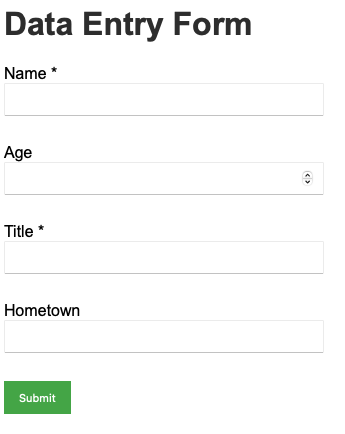
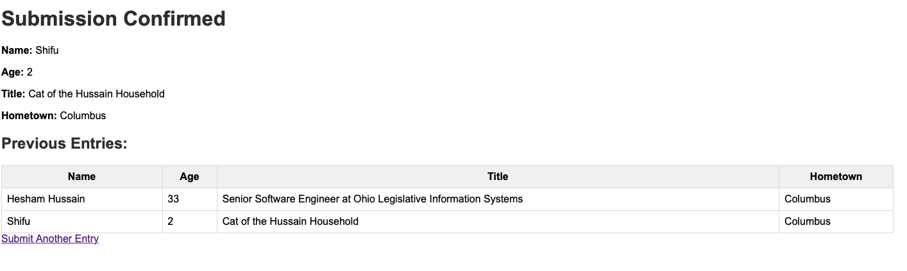

# 📋 Data Entry Web Application

A simple data entry web application built with **Java**, **Spring Boot**, and **Thymeleaf**. This app allows users to submit information through a form, validates required fields, and displays a confirmation page with a table of all previous submissions.

---

## 📸 **Project Demo**

### ✅ **Form Page**
 <!-- Replace '#' with your image link -->

### ✅ **Error Page**
 

### ✅ **Confirmation Page**


---

## 🚀 **Features**
- **Data Entry Form** with fields:
  - **Name** (Required)
  - **Age** (Optional)
  - **Title** (Required)
  - **Hometown** (Optional)
  
- **Form Validation** — Displays error messages for required fields.

- **Confirmation Page** — Shows the submitted data and a table of previous entries.

- **In-Memory Data Storage** — Keeps entries during the session (cleared on restart).

- **Basic CSS Styling** for a clean user interface.

---

## 🏗️ **Tech Stack**
- **Java 21**
- **Spring Boot 3.x**
- **Thymeleaf**
- **Maven**
- **H2 Database** 
- **HTML/CSS**

---

## 💻 **Getting Started**

### 🔧 **Prerequisites**
- **Java 21** installed ([Install JDK 21](https://adoptium.net/))
- **Maven** installed (`brew install maven` if using MacOS)
- **IntelliJ IDEA** (recommended) or any Java IDE

---

### 📂 **Clone the Repository**

```bash
git clone <your-github-repo-url>
cd dataentryapp
```

---

### 📦 **Setup & Install Dependencies**

1. Ensure **Java 21** is set as your default JDK:

   ```bash
   java -version
   ```

   If not, set it using:

   ```bash
   export JAVA_HOME=$(/usr/libexec/java_home -v 21)
   export PATH="$JAVA_HOME/bin:$PATH"
   ```

2. Build the project:

   ```bash
   mvn clean install
   ```

---

### ▶️ **Run the Application**

```bash
mvn spring-boot:run
```

Once the app starts, open your browser and go to:

```
http://localhost:8080/
```

---

## 📝 **How to Use the App**

1. **Navigate to the form page.**
2. **Fill out the form.**  
   - Ensure **Name** and **Title** are filled in — errors will show if they’re left blank.
3. **Submit the form.**
4. View the **confirmation page** with your data and a **table of all previous submissions**.
5. **Click "Submit Another Entry"** to go back to the form.

---

## 🎨 **Customization**

- **CSS Styling:**  
  Modify `src/main/resources/static/style.css` for styling tweaks.

- **In-Memory Data:**  
  Entries reset when the app restarts. To persist data, integrate a real database like **H2**, **MySQL**, or **PostgreSQL**.

---

## 🐞 **Troubleshooting**

- **Java version errors?**  
  Ensure you’re using **Java 21**.

- **Maven dependency issues?**  
  Run:

  ```bash
  mvn clean install -U
  ```

- **Port conflict?**  
  Change the port in `src/main/resources/application.properties`:

  ```properties
  server.port=8081
  ```

---

## 📁 **Folder Structure**

```
dataentryapp/
├── src/
│   ├── main/
│   │   ├── java/com/example/dataentryapp/
│   │   │   ├── DataentryappApplication.java
│   │   │   ├── controller/       # Handles form logic
│   │   │   ├── model/            # UserEntry data model
│   │   └── resources/
│   │       ├── templates/        # Thymeleaf templates (index.html, confirmation.html)
│   │       ├── static/           # Static resources (style.css)
│   │       └── application.properties
│   └── test/                     # Unit tests
│
├── pom.xml                        # Maven configuration
└── README.md                      # You're here! 😄
```

---


